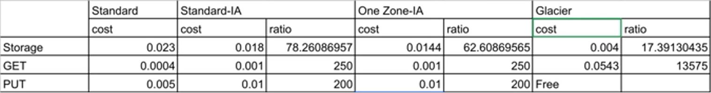
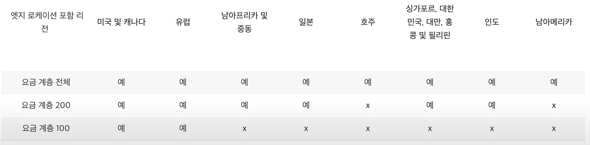
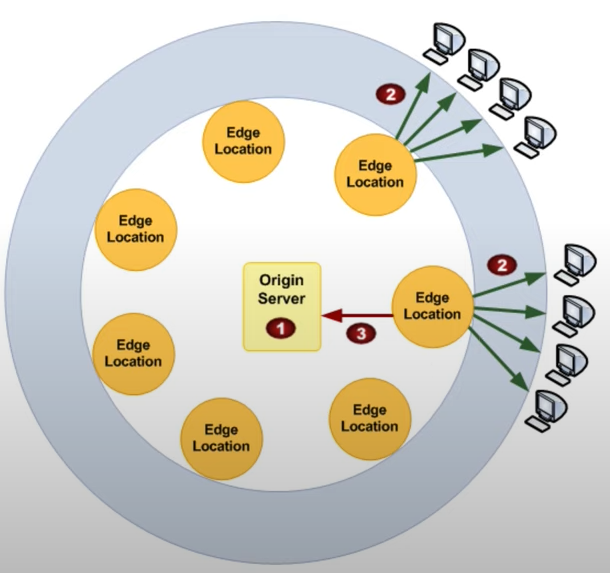

# AWS

## AWS 기초

### 클라우드 컴퓨팅?

- 남의 컴퓨터를 빌려서 원격제어를 통해 사용하는 것 (오래된 표현: Hosting)

### 어떤 일을 하고자 할 때, 필요한 두가지?

- '꿈' 과 '기능'

- 하지만, '꿈'없는 '기능'은 초라하다.

- '꿈' 즉, 목표를 만들고 '기능'을 공부하자

### 필요한 서비스 찾기

- 제품 탭에서 확인

## EC2

- Elastic Computer Cloud 약자

- 쉽게 생각하면 원격으로 사용가능한 컴퓨터 대여 서비스

### 요금 따져보기

- 제품 페이지 상단의 요금 탭

- 온디맨드: 사용하는 만큼 비용 지불

  - 온디맨드 탭을 선택하여 더 자세한 정보 확인 가능

- 예약 인스턴스: 선결제(일정 기간, 할인) 후 사용

### 프리티어 및 무료 서비스 확인

- aws.amazon.com/ko/free

- EC2 t2.micro 사용 예정

- 사용 금액 확인
  - 내 결제 대시보드에서 확인 가능

### 보안

- IAM
  - AWS의 인증 관련 서비스
  - IAM 대시보드의 보안 사항 체크리스트를 다 활성화 시키는게 좋음
  - 최소 MFA (Multi-Factor-Authentication) 활성화까지는 하는 것 권장

## S3

- simple storagy service

- 업로드된 파일이 인근 분산서버(3곳)에 나눠 백업됨

- 내구성이 높음을 보증

- 버전관리 기능을 보유하고 있음

- 라이프 사이클 기능 보유
  - 일정 기간을 설정하여, 오브젝트가 저장되는 시점부터 계산, 설정 기간이 되면 해당 오브젝트를 Standard -> Standart IA 또는 Standard IA -> Glacier 버킷으로 저장 위치를 자동 변경해주는 기능

### 구성요소

- 버킷

  - 하나의 프로젝트 레포지토리

- 폴더

  - 버킷내의 폴더

- 파일

  - S3에서는 파일을 '오브젝트'라 지칭

  ### 버킷 생성

  - 버킷 이름

    - amazon 서비스내에서 고유한 명사를 지녀야함

  - 리전

    - 서울 (서비스 인근 리전 선택)

  - ACL 관리
    - private라면 전부 체크
    - 일부분이라도 public이라면 체크 해제

### 버킷 읽기, 수정, 삭제

- 읽기

  - 버킷 내부 읽기
  - 버킷 클릭으로 버킷 내부 확인 가능

- 수정

  - 버킷 속성(설정) 수정
  - 괸리 페이지에서 수행

- 삭제
  - 버킷 삭제
  - 관리 페이지에서 수행

### 폴더 생성, 수정, 삭제

- 버킷 내에서 폴더 만들기 가능

- 폴더명 수정은 쉽지 않음, 반드시 수정이 필요하다면 새 폴더 생성 후 파일을 옮기고, 기존 폴더 삭제

### 객체 업로드, 수정, 삭제

- 디렉토리 및 파일 업로드 가능

- 디렉토리 업로드시, 내부 파일도 같이 업로드

- 객체 우클릭으로 수정 및 삭제 가능

### 공유와 권한

- 공유를 위한 오브젝트 권한 설정
  - 퍼블릭 액세스 활성화 시, 오브젝트 고유 링크를 통해 어디서든 접근 가능

### 스토리지 클래스

- 사용 사례 및 액세스 요구사항을 기준으로 선택하는 S3의 성능 옵션 및 가격 정책

  - 스탠다드: 자주 사용하는 데이터
  - 스탠다드 IA: 자주 사용하지 않는 데이터지만, 잃어버리면 안되는 데이터
  - 단일영역 IA: 자주 사용하지 않는 데이터이고, 잃어버려도 되는 데이터
  - 중복 감소(비권장): 사용하지 않는게 나음
  - 글래시어: 변경이 없는 데이터 + 장기간 보관해야하는 데이터, 로드시 몇시간이 걸릴 수 있다. (빠르게 읽어와야하는 데이터라면 보관하지 않을 것)

- 가용영역: 몇개의 복제본을 지닐지에 대한 옵션

### 요금

- 저장공간 요금

  - 스토리지 요금

- 사용 요금

  - 스탠다드
  - 스탠다드 IA
  - One Zone IA
  - 글래시어

- 스토리지 요금

  - 저장공간 사용에 대한 요금

- 데이터 전송 요금

  - 인터넷 요금
  - 업로드 공짜, 다운로드 비용 발생

- 요약  
  

## Cloud Front

- Cloud Front의 역할

  - Cache server + CDN (Content Delivery Network)
  - Cache server 기능, CDN 기능 둘 다 Cloud Front 사용 순간 default로 적용

- Cache server?

  - 사용자 요청에 따른 (대체로 정적인) 페이지를 WAS에서 받아놓고, 이후 같은 요청이라면 WAS가 아닌 Cache에 저장된 페이지를 사용자의 요청에 대한 응답으로 보내주는 서버

- CDN?
  - 전세계 어디서든 비슷하고 빠른시간 내에 접속할 수 있게 만들어주는 서비스

### Cloud Front 생성

- Origin: WAS

- Distribution: Cloud Front

### Cache server 설정

- Origin의 내용이 바뀌어도 Distribution에서는 반영이 되지 않는 문제 발생

  - Distribution의 설정을 변경하여 refresh를 더 자주 해야함

- 캐시 설정 변경

  - Distribution - Behaviors
    - path Pattern: 해당 패턴으로 들어오는 모든 result를 캐싱한다
    - Object Caching
      - Use Origin Cache Header: Origin의 Header의 Cache-Control 속성을 보고 Cache의 유효시간을 설정
      - Customize
        - Minimum TTL: 최소 Cache 유효시간 (Origin의 Cache-Control 속성의 유효시간이 더 작더라도 Minimum TTL의 유효시간을 가짐)
        - Maximum TTL: 최대 Cache 유효시간 (Origin의 Cache-Control 속성의 유효시간이 더 크더라도 Maximum TTL의 유효시간을 가짐)
        - Default TTL: 기본 Cache 유효시간 (Origin에서 Cache-Control 속성을 지정하지 않았을 경우)
    - Query String Forwarding and Caching
      - None: http(s)의 쿼리 요청에 대한 Cache 적용하지 않음
      - Forward all, cache based on all: http(s)의 모든 쿼리 요청에 대한 Cache 적용

- 요청 및 응답 순서

  - Web Browser에서 사용자 요청
  - Cloud Front가 받고, 해당 요청에 대한 페이지가 없다면, WAS로 요청
  - WAS는 해당 페이지 및 Header에 <u>Cache-Control</u> 속성을 포함하여 응답
    - Cache-Control: max-age=x
    - x: sec
    - "해당 시간 동안은 응답한 페이지가 유효하니, 요청하지 말 것" 의미
  - Cloud Front 또한 웹페이지 및 Cache-Control 속성을 포함하여 Web Browser에게 응답
  - Web Browser 및 Cloud Front는 Cache-Control 유효시간동안 같은 요청에 대해 자체적으로 해결

- Cache 무효화(삭제)
  - 기본적으로 Cloud Front의 default Cache 유효시간은 24시간
  - Cache 무효화 작업은 비용 발생
  - Distribution - invalidation
  - Create invalidation
    - Object Paths: 경로 또는 파일입력
      - 경로일시, 해당 경로 하위로는 전부 캐시 삭제
      - 파일일시, 해당 파일 캐시 전부 삭제

### CDN

- CDN 설정

  - Distribution - General - Edit
    - Price Class
      - Use All Edge Locations: 모든 Edge Locations 사용
      - Use 200 Edge Locations: 200에 해당하는 Edge Locations 사용
      - Use 100 Edge Locations: 100에 해당하는 Edge Locations 사용
        

- CDN 적용 관련 속도 테스트 사이트: [dotcom-tools](https://www.dotcom-tools.com/website-speed-test.aspx)

- Edge Location?

  - 전세계에 퍼져있는 Cloud Front의 Cache server

### 요금

- 기본요금 X, 사용하는 만큼 비용 발생

  

- 이미지의 2번 3번 요청에 대한 데이터 전송량 및 HTTP 메서드 요청량이 가장 중요한 요금 발생 지표

  - 2번: 리전 데이터를 인터넷으로 전송
  - 3번: 리전 데이터를 오리진으로 전송
  - HTTP 메서드: HTTP / HTTPS 요청

- aws 요금 계산을 도와주는 [웹사이드](https://calculator.s3.amazonaws.com/index.html)
  - cloud front
    - data transfer out: 2번에 대한 사용량
    - data transfer out to origin: 3번에 대한 사용량

### 추가 고려 사항

- Domain service (Amazon Route53)

- HTTPS / SSL / TLS (AWS certificate manager)

- Dynamic Page
  - Cloud Front의 Cookie / Header / GeoIP 등을 활용

## RDS

- (Managed) Relational Database

- EC2 대비 약 2배가량 비쌈

### DB 생성

- RDS - 인스턴스 - 데이터베이스 생성

- 처음 서비스에는 프리티어로만 진행해도 큰 무리가 없음

- 다중 AZ 배포

  - 같은 리전의 두 세곳의 DB에 데이터를 복제분산
  - 비용이 비싸다는 단점

- 저장장치의 유형 및 용량

  - 할당 스토리지가 높을수록 속도가 빠름
  - SSD 보다 IOPS가 더 빠르다
  - 유형 및 용량이 비용에 영향이 크다

- 인스턴스 식별자

  - DB명

- 마스터 사용자이름 및 비밀번호

  - root 사용자명
  - root 비밀번호

- 네트워크 및 보안

  - Virtual Private Cloud(VPC): 기본 VPC 사용
  - 퍼블릭 / 프라이빗: 퍼블릭일 경우, 외부 네트워크에서 접근 가능 / 프라이빗일 경우, 외부 네트워크에서 접근 불가능

- VPC?

  - AWS안에서 외부로부터 독립된 안전한 네트워크를 구성해주는 서비스
  - VPC <-> internet gateway <-> internet

- 백업

  - 백업보존기간: 자동 백업 파일을 n일 동안 가지고 있음

- 로그보내기

  - 감사/에러/일반/느린 쿼리 로그 등 로깅할 로그 종류를 선택

- 유지 관리
  - 마이너 버전 자동 업데이트: 메이저 버전이 아닌 **마이너 버전** 자동 업그레이드
  - 유지 관리 기간: DB의 업데이트 수정 등(서비스에 문제를 일으킬 여지가 있는 경우들)이 해당 기간(시간)에 진행되도록 설정, 미설정시 RDS의 기본 유지 관리 기간에 따름

### 퍼블릭 방식 접속

### 비공개 방식 접속

### 모니터링

### 백업과 복원

### 요금
